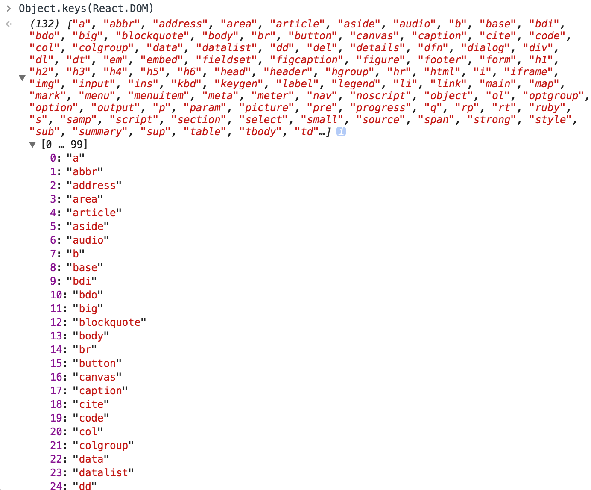

# chap01：Hello World

```
<!DOCTYPE html>
<html lang="en">
<head>
    <meta charset="UTF-8">
    <meta name="viewport" content="width=device-width, initial-scale=1.0">
    <meta http-equiv="X-UA-Compatible" content="ie=edge">
    <title>Hello React</title>
</head>
<body>
    <div id="app">
        <!-- 我的應用程式在此渲染 -->
    </div>
    <script src="react/build/react.js"></script>
    <script src="react/build/react-dom.js"></script>
    <script>
        // 我的應用程式的程式碼
        ReactDOM.render(
            React.DOM.h1(null, "Hello World!"),
            document.getElementById("app")
        );
    </script>
</body>
</html>
```

## 發生什麼事？

React物件被使用，所有可供利用的API都是透過這個物件提供，事實上，這個API刻意被極小化，因此沒有很多方法名稱需記憶。

ReactDOM物件，它的方法更是屈指可數，render()是其中最有用的，原本這些方法是React物件的一部分，然而，從0.14版開始，它們被劃分出來，強調應用程式的渲染(render)是獨立的關注點。可建立一支在不同環境下渲染的React應用程式：

- HTML(browser的DOM)
- 畫布(canvas)
- Android或IOS的原生環境
- ...等

**元件**(component)的概念，你使用元件建立UI，並且以你認為適當的方式組合這些元件，在你的應用程式中，你最後會建立自己的客製化元件，但為求一切順利，React提供一些**HTML DOM元素的包裏器**(wrapper)，你透過React.DOM使用這些包裏器，這例子，可看到h1元件的使用，它對應HTML `<h1>`元素，並讓你能透過`React.DOM.h1()`進行呼叫。

`document.getElementById("app")`，利用這段程式碼告訴React，這支應用程式放在頁面的哪裡，這是DOM操作連結到React領域的橋樑。

※ 一旦跨越這座橋樑，從DOM到React，就不必再擔心DOM操作，因為React會負責元件到底層平台(browser的DOM、畫布、原生應用程式等)的轉換工作。你**不必**擔心DOM，但不表示你無法干涉，假如因任何理由需要回到DOM領域，React也提供你必要的「逃生口」。

整個過程：你在DOM當中選擇特定位置渲染你的React元件，你總是渲染一個頂層元件，它可能包含你需要的所有子元件(和子孫元件)，這例子中，h1有一個子元件 —— “Hello World!”。

## React.DOM.*

React.DOM物件，以React元件的形式使用一些HTML元素。

※ 注意React.DOM與ReactDOM之間的差異，前者是**一群現成可用的HTML元素**，後者是在**瀏覽器中渲染應用程式的機制**(ReactDOM.render())



h1()的第一個參數(此案例為null)是物件，指明你想傳遞給元件的任何特性(想想DOM的屬性)。

```
React.DOM.h1(
  {
    id: "my-heading",
  },
  "Hello World!"
)
```

第二個參數定義該元素的子元素，最簡單情況就是文字子元素(也就是DOM的Text節點)，可嵌套許多子元素，並讓它們作為附加的函式參數來傳遞：

```
React.DOM.h1(
    { id: "my-heading" },
    React.DOM.span(null, "Hello"),
    " World!"
),
```

另一個例子，包含嵌套的元素：

```
React.DOM.h1(
    { id: "my-heading" },
    React.DOM.span(null,
        React.DOM.em(null, "Hell"),
        "o"
    ),
    " World!"
),
```

※ 如你所見，開始嵌套元件後，很快就會有大量的函式呼叫與括號需要注意與檢查，為求簡單，你可以使用**JSX語法**，第四章會討論。下面是JSX程式碼片段：

```
ReactDOM.render(
  <h1 id="my-heading">
    <span><em>Hell</em>o</span> world!
  </h1>,
  document.getElementById("app")
);
```

## 特殊的DOM屬性

特殊DOM屬性：class、for，與style。

你不能使用class與for，這些是JavaScript的保留字，需使用ClassName和htmlFor：

```
// 這段程式碼無法運作
React.DOM.h1(
  {
    class: "pretty",
    for: "me",
  },
  "Hello World!"
),

// 這段可以運作
React.DOM.h1(
  {
    className: "pretty",
    htmlFor: "me",
  },
  "Hello World!"
),
```

當論及style屬性，你不能像一般HTML那樣使用字串，而必須改用JavaScript物件，避開字串始終是個好主意，可減少跨網站指令搞(XSS)攻擊的風險，所以這是一個可喜可賀的改變：

```
// 這段程式碼無法運作
React.DOM.h1(
    {
        style: "background: black; color: white; font-family: Verdana"
    },
    "Hello World!"
),

// 這段可運作
React.DOM.h1(
    {
        style: {
            background: "black",
            color: "white",
            fontFamily: "Verdana",
        }
    },
    "Hello World!"
),
```

另外注意，處理CSS特姓，你必須使用JavaScript API名稱；使用fontFamily，而不是font-family。

## React DevTools瀏覽器擴展套件

可幫助你偵錯React應用程式的瀏覽器擴展套件。

## 下一步：自定元件

- 安裝、設置、並且使用React程式庫(只需要兩個<script>標籤)
- 在DOM當中選擇特定位置渲染你的React元件(e.g. `ReactDOM.render(reactWhat, domWhere)`)
- 使用內建的元件，這些是一般DOM元素的包裏器(e.g. `React.DOM.div(attributes, children)`)