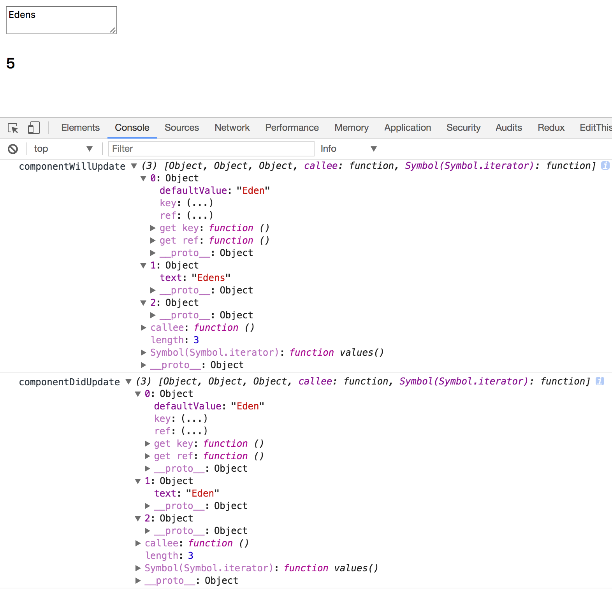

# chap01：Hello World

```
<!DOCTYPE html>
<html lang="en">
<head>
    <meta charset="UTF-8">
    <meta name="viewport" content="width=device-width, initial-scale=1.0">
    <meta http-equiv="X-UA-Compatible" content="ie=edge">
    <title>Hello React</title>
</head>
<body>
    <div id="app">
        <!-- 我的應用程式在此渲染 -->
    </div>
    <script src="react/build/react.js"></script>
    <script src="react/build/react-dom.js"></script>
    <script>
        // 我的應用程式的程式碼
        ReactDOM.render(
            React.DOM.h1(null, "Hello World!"),
            document.getElementById("app")
        );
    </script>
</body>
</html>
```

## 發生什麼事？

React物件被使用，所有可供利用的API都是透過這個物件提供，事實上，這個API刻意被極小化，因此沒有很多方法名稱需記憶。

ReactDOM物件，它的方法更是屈指可數，render()是其中最有用的，原本這些方法是React物件的一部分，然而，從0.14版開始，它們被劃分出來，強調應用程式的渲染(render)是獨立的關注點。可建立一支在不同環境下渲染的React應用程式：

- HTML(browser的DOM)
- 畫布(canvas)
- Android或IOS的原生環境
- ...等

**元件**(component)的概念，你使用元件建立UI，並且以你認為適當的方式組合這些元件，在你的應用程式中，你最後會建立自己的客製化元件，但為求一切順利，React提供一些**HTML DOM元素的包裏器**(wrapper)，你透過React.DOM使用這些包裏器，這例子，可看到h1元件的使用，它對應HTML `<h1>`元素，並讓你能透過`React.DOM.h1()`進行呼叫。

`document.getElementById("app")`，利用這段程式碼告訴React，這支應用程式放在頁面的哪裡，這是DOM操作連結到React領域的橋樑。

※ 一旦跨越這座橋樑，從DOM到React，就不必再擔心DOM操作，因為React會負責元件到底層平台(browser的DOM、畫布、原生應用程式等)的轉換工作。你**不必**擔心DOM，但不表示你無法干涉，假如因任何理由需要回到DOM領域，React也提供你必要的「逃生口」。

整個過程：你在DOM當中選擇特定位置渲染你的React元件，你總是渲染一個頂層元件，它可能包含你需要的所有子元件(和子孫元件)，這例子中，h1有一個子元件 —— “Hello World!”。

## React.DOM.*

React.DOM物件，以React元件的形式使用一些HTML元素。

※ 注意React.DOM與ReactDOM之間的差異，前者是**一群現成可用的HTML元素**，後者是在**瀏覽器中渲染應用程式的機制**(ReactDOM.render())


h1()的第一個參數(此案例為null)是物件，指明你想傳遞給元件的任何特性(想想DOM的屬性)。

```
React.DOM.h1(
  {
    id: "my-heading",
  },
  "Hello World!"
)
```

第二個參數定義該元素的子元素，最簡單情況就是文字子元素(也就是DOM的Text節點)，可嵌套許多子元素，並讓它們作為附加的函式參數來傳遞：

```
React.DOM.h1(
    { id: "my-heading" },
    React.DOM.span(null, "Hello"),
    " World!"
),
```

另一個例子，包含嵌套的元素：

```
React.DOM.h1(
    { id: "my-heading" },
    React.DOM.span(null,
        React.DOM.em(null, "Hell"),
        "o"
    ),
    " World!"
),
```

※ 如你所見，開始嵌套元件後，很快就會有大量的函式呼叫與括號需要注意與檢查，為求簡單，你可以使用**JSX語法**，第四章會討論。下面是JSX程式碼片段：

```
ReactDOM.render(
  <h1 id="my-heading">
    <span><em>Hell</em>o</span> world!
  </h1>,
  document.getElementById("app")
);
```

## 特殊的DOM屬性

特殊DOM屬性：class、for，與style。

你不能使用class與for，這些是JavaScript的保留字，需使用ClassName和htmlFor：

```
// 這段程式碼無法運作
React.DOM.h1(
  {
    class: "pretty",
    for: "me",
  },
  "Hello World!"
),

// 這段可以運作
React.DOM.h1(
  {
    className: "pretty",
    htmlFor: "me",
  },
  "Hello World!"
),
```

當論及style屬性，你不能像一般HTML那樣使用字串，而必須改用JavaScript物件，避開字串始終是個好主意，可減少跨網站指令搞(XSS)攻擊的風險，所以這是一個可喜可賀的改變：

```
// 這段程式碼無法運作
React.DOM.h1(
    {
        style: "background: black; color: white; font-family: Verdana"
    },
    "Hello World!"
),

// 這段可運作
React.DOM.h1(
    {
        style: {
            background: "black",
            color: "white",
            fontFamily: "Verdana",
        }
    },
    "Hello World!"
),
```

另外注意，處理CSS特姓，你必須使用JavaScript API名稱；使用fontFamily，而不是font-family。

## React DevTools瀏覽器擴展套件

可幫助你偵錯React應用程式的瀏覽器擴展套件。

## 下一步：自定元件

- 安裝、設置、並且使用React程式庫(只需要兩個<script>標籤)
- 在DOM當中選擇特定位置渲染你的React元件(e.g. `ReactDOM.render(reactWhat, domWhere)`)
- 使用內建的元件，這些是一般DOM元素的包裏器(e.g. `React.DOM.div(attributes, children)`)

# chap02：元件的生命

現在知道如何使用現成的DOM元件，現在就來練習如何建立自己的元件。

## 最低限度

建立新元件的API：

```
var MyComponent = React.createClass({
  /* specs */
})
```

"specs"是JavaScript物件，包含一個名為`render()`的必要方法，以及一些選用的方法與特性，最基本例子：

```
var Component = React.creatClass({
  render: function() {
    return React.DOM.span(null, "I'm so custom");
  }
});
```

唯一需要實作的就是`render()`方法，這個方法**必須回傳React元件**。

在應用程式中使用你的元件就類似使用DOM元件

```
ReactDOM.render(
  React.createElement(Component),
  document.getElementById("app")
);
```

`React.createElement()`是為你的元件建立「實例」(instance)的一個方法。如果要建立數個實例，還有另一個方法是利用工廠(factory)：

```
var ComponentFactory = React.createFactory(Component);

ReactDOM.render(
    ComponentFactory(),
    document.getElementById("app")
);
```

你已經知道`React.DOM.*`方法實際上只是`React.createElement()`的方便包裏器。換言之，可這樣操作DOM元件：

```
ReactDOM.render(
    React.createElement("span", null, "Hello"),
    document.getElementById("app")
);
```

如你所見，DOM元素以字串的方式被定義，而不是JavaScript函式(如自訂元件的案例)。

## 特性

你的元件可以接受特性並且渲染它們，或根據特性的值產生不同行為。所有特性可透過this.props物件來存取：

```
var Component = React.createClass({
    render: function() {
        return React.DOM.span(null, "My name is " + this.props.name);
    }
});

ReactDOM.render(
    React.createElement(Component, {
        name: "Eden",
    }),
    document.getElementById("app")
);
```

※ 把`this.props`想成是唯讀的。特性可用來將組態從父元件傳遞到子元件(以及從子元件到父元件)。如果你覺得很想要設定this.props的特性，就使用額外的變數，或改用元件之規格物件的特性(如this.thing，而非this.props.thing)。事實上ECMAScript5瀏覽器中，你無法改變this.props，因為：

```
> Object.isFrozen(this.props) === true; // true
```

## PropTypes

在你的元件中，可添加名為propTypes的特性，宣告你的元件準備接受哪些特性，以及它們的型別：

```
var Component = React.createClass({
    propTypes: {
        name: React.PropTypes.string.isRequired,
    },
    render: function() {
        return React.DOM.span(null, "My name is " + this.props.name);
    }
});
```

propTypes是選用的，但它有兩個好處：

- 事先宣告元件預期什麼特性，元件的使用者不需要檢視render()函式的原始碼(可能很長)，就能明白他們可使用哪些特性來組態這個元件。
- React在執行時期驗證特性值，所以你可放心撰寫你的render()函式，無需小心翼翼地堤防你的元件會收到什麼可怕的資料。

如果忘記傳遞該值，控制台會顯示警告訊息：

```
ReactDOM.render(
    React.createElement(Component, {
        // name: "Eden",
    }),
    document.getElementById("app")
);
```

```
Warning: Failed propType: Required prop `name` was not specified in `Constructor`.
```

如果提供整數，也會得到警告訊息：

```
ReactDOM.render(
    React.createElement(Component, {
        name: 123,
    }),
    document.getElementById("app")
);
```

```
Warning: Failed propType: Invalid prop `name` of type `number` supplied to `Constructor`, expected `string`.
```

列出可用來宣告你的預期PropTypes。

```
> Object.keys(React.PropTypes).join('\n');
  "array
  bool
  func
  number
  object
  string
  any
  arrayOf
  element
  instanceOf
  node
  objectOf
  oneOf
  oneOfType
  shape"
```

### 預設的特性值

當你的元件接受選用的特性時，必須特別注意，當那些特性未提供，元件還是必須能正常運作，無可避免，這會導致防禦性的樣板程式碼：

```
var text = 'text' in this.props ?this.props.text : '';
```

可透過實作`getDefaultProps()`方法來避免撰寫這種程式碼(聚焦於更重要的部分)：

```
var Component = React.createClass({
  propTypes: {
    firstName: React.PropTypes.string.isRequired,
    middleName: React.PropTypes.string,
    familyName: React.PropTypes.string.isRequired,
    address: React.PropTypes.string,
  },
  
  getDefaultProps: function() {
    return {
      middleName: '',
      address: 'n/a',
    };
  },
  
  render: function() {/* ... */}
});
```

如你所見，`getDefaultProps()`回傳物件，為每個選用的特性(no isRequired的特性)提供合理的值。

## 狀態

目前所舉的例子都是相當靜態(無狀態)。React真正的亮點是在應用程式發生資料改變時的絕妙處理機制(相對的，老派的browser DOM操作與維護工作顯得很複雜)。React具有**狀態**(state)的概念，也就是元件用來渲染它自己的資料。當狀態改變，React重新建構UI，不需你做任何事，因此，在最初完成UI(在你的render())之後，你只需關心資料更新，而不需擔心資料調整，畢竟，你的render()方法已經提供元件外觀應有的藍圖。

※ 呼叫setState()之後，UI更新透過佇列機制而完成，有效地以批次方式進行變更，因此，直接更新`this.state`會產生意外的行為，而且你不該這樣做，就像`this.props`，請將`this.state`考慮成唯讀物件，不僅因為這樣做從語義上來看是一個壞主意，而且會以出乎意料的方式運作，同樣地，不要自行呼叫`this.render()`——相反地，將它留給React進行批次處理，React會判斷最少變更量，並且在適當時機呼叫render()。

類似透過`this.props`存取特性，你藉由`this.state`物件存取狀態，為了更新狀態，可使用`this.setState()`，當`this.setState()`被呼叫時，React呼叫你的`render()`方法，並且更新UI。

※ React在setState()被呼叫時更新UI，這是最常見的使用情節，但這裡有逃生口。可藉由名為shouldComponentUpdate()的特殊「生命週期」方法中回傳false，阻止UI被更新。

## 有狀態的TextArea元件

首先，建立不處理更新的「無狀態」版本：

```
var TextAreaCounter = React.createClass({
    propTypes: {
        text: React.PropTypes.string,
    },
    getDefaultProps: function () {
        return {
            text: '',
        };
    },
    render: function() {
        return React.DOM.div(null,
            React.DOM.textarea({
                defaultValue: this.props.text,
            }),
            React.DOM.h3(null, this.props.text.length)
        )
    }
});

ReactDOM.render(
    React.createElement(TextAreaCounter, {
        text: "Eden"
    }),
    document.getElementById("app")
);
```

※ 前段程式碼中的textarea接受defaultValue特性，而不是文字子元素(就像你在一般HTML中習以為常的那樣)，這是因為，當論及表單時，React與老式HTML之間存在一些細微差異，第四章就會討論到這件事。不會有太大差別。

下一步是把這無狀態元件轉變成**有狀態**的元件，我們讓這個元件維護某些資料(狀態)，並且利用這些資料在一開始渲染它自己，並在稍後資料發生改變時更新它自己(重新渲染)。

在你的元件實作getInitialState()的方法，確保你操作的總是正確的資料：

```
getInitialState: function () {
    return {
        text: this.props.text,
    };
},
```

可透過`this.state.text`存取。一開始(在getInitialState()中)，你直接複製text特性，之後當資料發生變化(使用者進行輸入)時，這個元件利用輔助方法(helper method)更新其狀態。

```
_textChange: function(ev) {
    this.setState({
        text: ev.target.value,
    });
},
```

你總是利用`this.setState()`更新狀態，這個方法接受物件，並將它與`this.state`裡頭既有的資料合併起來。

`_textChange()`是個事件偵聽器。

最後要做的就是更新render()方法，使用`this.state`代替`this.props`，並設定事件偵聽器。

```
render: function () {
    return React.DOM.div(null,
        React.DOM.textarea({
            value: this.state.text,
            onChange: this._textChange,
        }),
        React.DOM.h3(null, this.state.text.length)
    )
}
```

現在每當輸入textarea，計數器更新，反映實際的輸入內容。

## DOM事件說明

為避免混淆，針對這行程式碼做點澄清：

```
onChange: this._textChange
```

為求效能、便捷、清楚、與合理，React使用自己的**合成事件系統**(synthetic events system)，為幫忙理解箇中原由，你必須思考在單純的DOM世界裡頭事情是如何運作的。

### 舊時代的事件處理

使用**行內事件處理器**(inline event handler)是很方便的：

```
<button onclick="doStuff">
```

雖方便且易讀(事件監聽器與UI同在)，然而，太多事件監聽器像這樣四處散落卻是欠缺效率的，而且也不容易在相同按鈕上安排多個監聽器，尤其是當該按鈕位在別人的「元件」或程式庫中，因此在DOM世界裡，人們使用`element.addEventListener`設置監聽器(listener，現在導致相關程式碼散落兩處，甚至多處)以及**事件委託**機制(event delegation，為解決效能問題)。事件委託機制意味著你在某個父節點偵聽多個事件，例如，包含多個按鈕的<div>，你為所有按鈕設置一個偵聽器。

```
<div id="parent">
    <button id="ok">ok</button>
    <button id="cancel">Cancel</button>
</div>
<script>
    document.getElementById('parent').addEventListener('click', function (event) {
        var button = event.target;

        // 根據被點擊的按鈕不同，做不同的事情
        switch (button.id) {
            case 'ok':
                console.log('OK!');
                break;
            case 'cancel':
                console.log('Cancel');
                break;
            default:
                new Error('Unexpected button ID');
        }
    });
</script>
```

這樣可行，效能也沒問題，但也有幾個缺點：

- 偵聽器的宣告更遠離UI元件，使得程式碼更難追蹤及偵錯。
- 使用事件委託機制，搭配switch，導致不必要的樣板程式碼，甚至是在你可以做實際的工作之前。
- 瀏覽器不一致實際上會讓這段程式碼變得更冗長。

將這段程式碼呈現在真實的使用者前，你需補充更多東西，才能支援所有瀏覽器。

- 除了addEventListener，你還需要attachEvent。
- 你必須在偵聽器頂端增加`var event = event || window.event;`。
- 你需要`var button = event.target || event.srcElement;`。

所有這些東西都不可少，且相當煩人，足以迫使你採用某個事件程式庫，但是，何必添加另一個程式庫(並學習更多API)，React已經隨附一個克服事件處理夢魘的解決方案。

### React的事件處理

React使用**合成事件**(synthetic event)，以便包裏及標準化瀏覽器事件，這表示，不再有瀏覽器不一致，你可永遠放心相信：所有瀏覽器皆支援`event.target`，這也表示，對所有瀏覽器來說，取消事件的API都一樣；換言之，`event.stopPropagation()`和`event.preventDefault()`即使老舊IE也能運作。

這樣的語法很容易讓UI與事件偵聽器保持在一起，看起來好像老式的行內事件處理器，但背後並非如此，事實上，基於效能考量，React採取事件委託機制。

針對事件處理器，React使用駝峰語法，因此，請使用`onClick`代替`onclick`。

無論什麼原因，如果你需要原始的瀏覽器事件，大可利用`event.nativeEvent`，不過，這種機會應該很少。

還有一件事：onChange事件的行為正如你預期：它在使用者進行欄位輸入當下被觸發，而非完成輸入並且離開這個欄位之後，這是單純DOM的行為。

### Props vs. State

特性(property)是讓外界(元件使用者)組態你的元件的機制，狀態(state)是關於內部資料的維護，因此，如果你去類比物件導向編程，`this.props`就如同傳遞給**類別建構式**的所有引數，`this.state`則是你的一群**私有特性**。

## 在初始狀態中的特性：反模式

```
getInitialState() {
  return {
    text: this.props.text,
  };
}
```

這實際上被視為一種反模式。理想情況下，以你覺得合適方式，隨意組合`this.state`和`this.props`，在render()方法中打造你的使用者介面。

但有時候，你會想要利用傳遞給元件的值，並且使用它建構初始狀態，這沒什麼不對，但元件的呼叫者可能期望這個特性總是具有最新的值，前述範例違反這種期望，為求簡明清楚，單純的命名變更就夠了 —— 例如，把該特性稱作defaultText或initialValue之類的東西，而不只是text：

```
propTypes: {
    defaultValue: React.PropTypes.string,
},

getDefaultProps: function () {
    return {
        defaultValue: '',
    };
},

getInitialState: function () {
    return {
        text: this.props.defaultValue,
    };
},


ReactDOM.render(
    React.createElement(TextAreaCounter, {
        defaultValue: "Eden"
    }),
    document.getElementById("app")
);
```

※ 第四章會說明React如何針對它自己的欄位輸入元素與文字輸入方框的實作解決這個問題。

## 從外部存取元件

有時候，你必須掛鉤到既有的應用程式或網站，一部份一部份地移植到React，幸運的是，React根本上被設計來搭配任何預先存在的程式碼基礎。

讓React應用程式與外界溝通的一個方法，就是取得`ReactDOM.render()`所渲染之元件的參考，並且從元件外部使用它：

```
var myTextAreaCounter = ReactDOM.render(
    React.createElement(TextAreaCounter, {
        defaultValue: "Eden"
    }),
    document.getElementById("app")
);
```

現在你可使用myTextAreaCounter存取相同的方法和特性(跟你在元件中使用this一樣)，甚至可以使用JavaScript控制台來檢視這個元件：


這行設定某種新狀態：

```
myTextAreaCounter.setState({text: "Hello outside world!"});
```

這行取得指向React所建立之DOM主要父節點的參考：

```
var reactAppNode = ReactDOM.findDOMNode(myTextAreaCounter);
```

這是`<div id="app">`的第一個子元素，這就是你要求React變戲法的地方：

```
reactAppNode.parentNode === document.getElementById('app'); // true
```

這裡說明如何存取特性和狀態：

```
myTextAreaCounter.props;
myTextAreaCounter.state;
```

※ 你可從元件外面存取整個元件API，但真要這麼做，你應該謹慎運用這項新穎的超能力。如果你要取得節點規模，以確保它的尺寸適合你的整個頁面，或許可使用`ReactDOM.findDOMNode()`，但僅止於此。如果忍不住胡亂操作不屬於你的元件，可能會違反原有的預期，並產生臭蟲，因為該元件並未預期這類「侵入式干預」，例如下列這段程式碼，但真的不建議：

```
// 反例
myTextAreaCounter.setState({text: "NOOOO"});
```

## 中途更改特性

特性是組態元件的一種機制。因此，在建立元件之後，從外部改變特性自然是件合理的事。但，你的元件應該有所準備，才能處理這種使用情節。

檢視之前範例render()方法，你會發現它僅使用`this.state`：

```
render: function () {
    return React.DOM.div(null,
        React.DOM.textarea({
            value: this.state.text,
            onChange: this._textChange,
        }),
        React.DOM.h3(null, this.state.text.length)
    )
}
```

如果你從元件外部改變這些特性，並不會產生渲染的效果，換句話說，textarea的內容在你進行下列操作之後不會發生改變：

```
myTextAreaCounter = ReactDOM.render(
    React.createElement(TextAreaCounter, {
        defaultValue: "Hello", // 先前為“Eden”
    }),
    document.getElementById("app")
);
```

※ 即使myTextAreaCounter被新的ReactDOM.render()呼叫重寫過，應用程式的狀態仍然維持不變，
React先後「調節」(reconciliation)這支應用程式，但並未抹除一切，相反地，它盡可能應用最小的變更量。

this.props已經改變，但UI沒變：

```
> myTextAreaCounter.props; // Object {defaultValue: "Hello"}
```

```
// 反例
myTextAreaCounter.setState({text: "Hello"});
// 這是糟糕的主意，因它在更複雜的元件中可能導致不一致狀態；例如，弄亂內部計數器、布林旗標、事件監聽器、等等。
```

如果想要優雅處理外部干擾(特性的變更)，可預先實作名為`componentWillReceiveProps()`的方法：

```
componentWillReceiveProps: function (newProps) {
    this.setState({text: newProps.defaultValue});
},
```

這個方法接受新的特性物件，你可根據需求設定狀態，並且配合其他必要工作，讓元件保持正常狀態。

## 生命週期方法

componentWillReceiveProps()方法是React提供的生命週期之一，你可使用它來偵聽元件的變更。你可實作其他生命週期方法：

- componentWillUpdate()

    在元件的render()方法再次被呼叫(特性或狀態的改變)之前被執行。

- componentDidUpdate()

    在render()方法完成且新的底層DOM變更發生之後被執行。

- componentWillMount()

    在節點被插入DOM之前被執行。

- componentDidMount()

    在節點被插入DOM之後被執行。

- componentWillUnmount()

    在元件從DOM移除之前被執行。

- shouldComponentUpdate(newProps, newState)

    這個方法在componentWillUpdate()之前被呼叫，並且給你機會回傳false；取消更新，這表示你的render()不會被呼叫，這在效能至關重要的領域中是相當有用的 —— 當你認為沒有重要的變更，而且不需要渲染時，根據newState引數與既有`this.state`的比較，newProps與`this.props`的比較，或者，單純知道這個元件是靜態、不會改變的，你據以進行決策。
    
## 生命週期範例：全部紀錄

讓我們在TextAreaCounter元件中增加一些日誌紀錄，簡單實作所有生命週期方法，被呼叫時將相關訊息伴隨引數紀錄到控制台上：

```
var TextAreaCounter = React.createClass({

    _log: function(methodName, args) {
        console.log(methodName, args);
    },
    componentWillUpdate: function () {
        this._log('componentWillUpdate', arguments);
    },
    componentDidUpdate: function () {
        this._log('componentDidUpdate', arguments);
    },
    componentWillMount: function () {
        this._log('componentWillMount', arguments);
    },
    componentDidMount: function () {
        this._log('componentDidMount', arguments);
    },
    componentWillUnmount: function () {
        this._log('componentWillUnmount', arguments);
    },
    
    // ...
    // 更多實作，render()，等等
```

載入頁面console結果：

```
componentWillMount Arguments(0)
componentDidMount Arguments(0)
```

兩個方法呼叫不帶任何引數，componentDidMount()通常比較有趣，需要的話，你可利用`ReactDOM.findDOMNode(this)`存取新掛載的DOM節點，例如，取得元件的尺寸。既然你的元件確實存在，你就可以做任何類型的初始化工作。

接下來，鍵入"s"產生文字"Edens"：



componentWillUpdate(nextProps, nextState)方法伴隨著新資料被呼叫，這些新資料會被用來重新渲染這個元件，第一個引數是this.props的未來值，第二個引數是新的this.state的未來值，第三個是context，這引數在這階段並不要緊。你可將引數(e.g. newProps)與當前的this.props做比較，並且決定是否對它採取適當的行動。

在呼叫componentWillUpdate()之後，你看到componentDidUpdate(oldProps, oldState)被呼叫，傳遞props與state在變更之前的值，這是在變更發生之後做某事的機會，你可在這裡使用setState()，你無法在componentWillUpdate()裏頭做這件事。

譬如說，你想要限制輸入textarea的字元數，你應該在事件處理器_textChange()做這件事，它在使用者鍵入資料時被呼叫，但萬一有人從元件外部呼叫setState()？你還能保護元件的一制性與健全性嗎？當然，你可以在componentDidUpdate()中進行驗證，如果字元數大於允許的限制，即將狀態回復原有的樣子：

```
componentDidUpdate: function(oldProps, oldState) {
    if (this.state.text.length > 4) {
        this.replaceState(oldState);
    }
}
```

※ 注意，使用replaceState()代替setState()，setState(obj)將obj的特性與this.state特性**合併**，而replaceState()則**覆寫一切**。

## 生命週期範例：使用Mixin

前面例子，你看到五個生命週期方法呼叫有四個被記錄下來，當你有子元件被父元件移除，第五個生命週期方法，componentWillUnmount()，最能夠清楚指名這件事。此範例中，你想要同時在子元件與父元件中紀錄所有變更，所以讓我們引進程式碼重利用的新概念：mixin(混入)。

mixin是包含一組方法與特性的JavaScript物件，mixin不是為了單獨使用，而是要被包含到(被混入)另一個物件的特性中，在日誌紀錄範例中，mixin看起來像這樣：

```
var logMixin = {
    _log: function (methodName, args) {
        console.log(methodName, args);
    },
    componentWillUpdate: function () {
        this._log('componentWillUpdate', arguments);
    },
    componentDidUpdate: function () {
        this._log('componentDidUpdate', arguments);
    },
    componentWillMount: function () {
        this._log('componentWillMount', arguments);
    },
    componentDidMount: function () {
        this._log('componentDidMount', arguments);
    },
    componentWillUnmount: function () {
        this._log('componentWillUnmount', arguments);
    },
};
```

在非React的世界裡，你可利用for-in迭代繞行，並且將所有特性複製到新物件中，這樣讓新的物件獲得mixin的所有功能。在React的世界裡，你擁有一種便捷的機制：mixins特性：

```
var MyComponent = React.createClass({
  mixins: [obj1, obj2, obj3],
  // 其餘的方法...
},
```

你將JavaScript物件的陣列指定給mixins特性，React負責處理其餘工作。

```
var TextAreaCounter = React.createClass({

    name: 'TextAreaCounter',
    mixins: [logMixin],
    
    // 其餘的方法 ...
```

這段程式碼加上便捷的name特性來識別呼叫者。

執行這段包含mixin的範例，可看到日誌紀錄的運作。

## 生命週期範例：使用子元件

你知道你能以你認為合適、嵌套的方式，混合及組織React元件，目前為止，你在render()方法中只看到React.DOM元件(相對於自訂元件)，現在看看簡單的自訂元件如何被當作子元件來使用：

可將計數器的部分變成獨立的元件：

```
var Counter = React.createClass({
    name: 'Counter',
    mixins: [logMixin],
    propTypes: {
        count: React.PropTypes.number.isRequired,
    },
    render: function () {
        return React.DOM.span(null, this.props.count);
    }
});
```

這個元件只是計數器的部分，沒維護狀態，只顯示由父元件提供的count特性。另外，它也混入logMixin。

更新TextAreaCounter父元件的render()方法，並有條件的使用Counter元件：

```
render: function () {
    var counter = null;
    if (this.state.text.length > 0) {
        counter = React.DOM.h3(null,
            React.createElement(Counter, {
                count: this.state.text.length,
            })
        );
    }
    return React.DOM.div(null,
        React.DOM.textarea({
            value: this.state.text,
            onChange: this._textChange,
        }),
        counter
    );
}
```

注意，不需要將整個UI以行內方式作為主要元件React.DOM.div的引數，你可將UI的某些片段指定給不同的變數，並根據實際的需求，有條件地使用。

現在，加載頁面，然後改變textarea內容：


可看到子元件在父元件之前被掛載與更新。

刪除textarea文字之後，計數變0，Counter元件變null，它的DOM節點從DOM樹狀結構中被移除，就在componentWillUnmount回呼通知你之後。


## 效能提升：阻止元件更新

最後一個生命週期方法 —— 尤其在建構應用程式的效能關鍵零組件時 —— 就是shouldComponentUpdate(nextProps, nextState)方法，它在componentWillUpdate()之前被呼叫，提供給你一個機會：如果決定沒要那樣做，就把更新取消。

還有一類文件，僅於它們的render()方法中使用this.props與this.state，而且沒有額外的函式呼叫，這些元件被稱作「純」元件，他們可實作shouldComponentUpdate()，並且比較前後的狀態與特性，如果沒有任何改變，就回傳false，節省一些處理能力。另外，還有一些單純的靜態元件，既不使用props，也不使用state，這種的就能直接回傳false。

現在來探索render()，並實作shouldComponentUpdate()，以求效能提升：

將日誌紀錄移除，改在render()做紀錄：

```
var Counter = React.createClass({
    name: 'Counter',
//    mixins: [logMixin],
    propTypes: {
        count: React.PropTypes.number.isRequired,
    },
    render: function () {
        console.log(this.name + '::render()');
        return React.DOM.span(null, this.props.count);
    }
});
```

```
var TextAreaCounter = React.createClass({

    name: 'TextAreaCounter',
//    mixins: [logMixin],

    // 所有其他方法
    
    render: function () {
        console.log(this.name + '::render()');
        // ...
    }
});
```

現在在加載頁面並貼上字串"Mary"取代"Eden"，console：

```
TextAreaCounter::render()
Counter::render()
TextAreaCounter::render()
Counter::render()
```

更新前後的字元數目都一樣，所以計數器的UI沒有變化，不需呼叫Counter的render()方法。

```
shouldComponentUpdate: function(nextProps, nextState) {
    return nextProps.count !== this.props.count;
},
```

將"Eden"更新"Mary"後：

```
TextAreaCounter::render()
Counter::render()
TextAreaCounter::render()
```

## PureRenderMixin

shouldComponentUpdate()的實作非常簡單，且很容易就能讓這實作一般化，因為你總是會比較this.props與nextProps，以及this.state與nextState，React以mixin的形式提供這樣的通用實作，讓你能簡單地將它包含在任何元件中。

```
<script src="react/build/react-with-addons.js"></script>
<script src="react/build/react-dom.js"></script>
<script>

    var Counter = React.createClass({
        name: 'Counter',
        mixins: [React.addons.PureRenderMixin],
        propTypes: {
            count: React.PropTypes.number.isRequired,
        },
        render: function () {
            console.log(this.name + '::render()');
            return React.DOM.span(null, this.props.count);
        }
    });
```

結果，字元不變，Counter的render()方法並未被呼叫。

PureRenderMixin並非React核心的一部分，但確實是React附加組件之擴充版本的一部分，因此，必須包含`react/build/react-with-addons.js`，這提供你新的名稱空間React.addons，而且，可在當中找到PureRenderMixin，以及其他絕妙的附加組件。

如不想包含所有附加組件，只想實作自己的mixin版本，儘管窺探這項實作，僅作淺層比較(shallowEqual)，而非遞迴式的深層比較：

```
/**
 * Does a shallow comparison for props and state.
 * See ReactComponentWithPureRenderMixin
 */
function shallowCompare(instance, nextProps, nextState) {
  return !shallowEqual(instance.props, nextProps) || !shallowEqual(instance.state, nextState);
}
```

# chap03：Excel：精心設計的表格元件

建立資料表，它讓你編輯資料表內容，排序及搜尋(過濾)資料，並將它們匯出為可下載的檔案。

## 資料優先

表格元件(何不乾脆稱呼Excel)，應該接受標題陣列與資料陣列，以下是史上最暢銷書籍組成清單：

```
var headers = [
    "Book", "Author", "Language", "Published", "Sales"
];

var data = [
    ["The Lord of the Rings", "J. R. R. Tolkien", "English", "1954–1955", "150 million"],
    ["Le Petit Prince (The Little Prince)", "Antoine de Saint-Exupéry", "French", "1943", "140 million"],
    ["Harry Potter and the Philosopher's Stone", "J. K. Rowling", "English", "1997", "107 million"],
    ["And Then There Were None", "Agatha Christie", "English", "1939", "100 million"],
    ["Dream of the Red Chamber", "Cao Xueqin", "Chinese", "1754–1791", "100 million"],
    ["The Hobbit", "J. R. R. Tolkien", "English", "1937", "100 million"],
    ["She: A History of Adventure", "H. Rider Haggard", "English", "1887", "100 million"],
];
```

## 表格標題迴圈

首先，踏出第一步，僅顯示標題實作：

```
var Excel = React.createClass({
    render: function () {
        return (
            React.DOM.table(null,
                React.DOM.thead(null,
                    React.DOM.tr(null,
                        this.props.headers.map(function (title) {
                            return React.DOM.th(null, title);
                        })
                    )
                )
            )
        );
    }
});
```

以下為用法：

```
ReactDOM.render(
    React.createElement(Excel, {
        headers: headers,
        initialData: data
    }),
    document.getElementById("app")
);
```

陣列的map()方法，這方法被用來回傳一序列子元件。在此，map()方法擷取各元素，並將它傳遞給回呼函式，回呼函式建立新的<th>元件，並且回傳它。

這是React之所以美妙的一部份原因 ── 你使用JavaScript建立UI，而且JavaScript的所有威力皆聽你差遣，迴圈與條件語法照常使用，你不需學習另一種「樣板」語言或語法，就能建構UI。

※ 你能以單一陣列引數的方式將所有子元素傳遞給元件，代替你目前看到的作法 ─ 將每個子元素作為個別的引數來傳遞。總之，兩個方法皆可行：

```
// 獨立引數
React.DOM.ul(
  null,
  React.DOM.li(null, "one"),
  React.DOM.li(null, "two")
);
// 陣列
React.DOM.ul(
  null,
  [
    React.DOM.li(null, "one"),
    React.DOM.li(null, "two")
  ]
);
```

## 偵錯控制台的警告

```
react.js:19368 Warning: Each child in an array or iterator should have a unique "key" prop. Check the render method of `Constructor`. See https://fb.me/react-warning-keys for more information.
```

陣列或迭代器裡的每個子元素都應具有獨特的"key"特性。在現實生活中，可能會有許多元件建立<tr>元素。Excel只是React世界以外被指定某個React元件的變數，所以React無法理解這個元件名稱，然而，你可透過宣告displayName特性，幫忙處理這件事：

```
var Excel = React.createClass({
    displayName: 'Excel',
    render: function () {
        // ...
    }
});
```

現在，React可以識別問題所在，並警告你

```
Warning: Each child in an array or iterator should have a unique "key" prop. Check the render method of `Excel`. See https://fb.me/react-warning-keys for more information.
```

為了修復它，請根據警告內容來處理問題，現在，你知道究竟是哪個render()惹的禍：

```
this.props.headers.map(function (title, idx) {
    return React.DOM.th({key: idx}, title);
})
```

為把key特性提供給React，你可簡單使用陣列元素的索引(idx)，這些鍵只需要在這陣列裡維持獨一無二，不必在整個React應用程式中保持唯一。

※ 使用JSX，你不需要定義displayName這個特性，因為這名稱會自動被延生出來。

## 添加<td>內容

```
this.state.data.map(function (row, idx) {
    return (
        React.DOM.tr(null,
            row.map(function (cell, idx) {
                return React.DOM.td(null, cell)
            })
        )
    );
})
```

還有一件事要考慮，data變數的內容，會從元件呼叫者傳遞資料，但稍後，表格會持續存在，資料會改變，因使用者理應能排序、編輯等，換言之，元件狀態會變化，所以使用`this.state.data`追蹤這些改變，並利用this.props.initialData，讓呼叫者初始化元件。

```
getInitialState: function () {
    return {data: this.props.initialData}
},
render: function () {
    return (
        React.DOM.table(null,
            React.DOM.thead(null,
                React.DOM.tr(null,
                    this.props.headers.map(function (title, idx) {
                        return React.DOM.th({key: idx}, title);
                    })
                )
            ),
            React.DOM.tbody(null,
                this.state.data.map(function (row, idx) {
                    return (
                        React.DOM.tr({key: idx},
                            row.map(function (cell, idx) {
                                return React.DOM.td({key: idx}, cell)
                            })
                        )
                    );
                })
            )
        )
    );
}
```


可看到，重複的`{key: idx}`為元件陣列的每個元素提供獨一無二的值(react DevTools)，然而，所有的.map()迴圈從索引0開始，這沒問題，因這些鍵只需在當前的迴圈中獨一無二，而非在整個應用程式中都是唯一。

接下來增加PropTypes特性，這項機制既可處理資料驗證，又能作為元件說明，讓我們盡可能保持明確。React.PropTypes提供陣列驗證器，並可進一步搭配arrayOf，藉此，你能指定陣列元素的型別：

```
propTypes: {
    headers: React.PropTypes.arrayOf(
        React.PropTypes.string
    ),
    initialData: React.PropTypes.arrayOf(
        React.PropTypes.arrayOf(
            React.PropTypes.string
        )
    ),
},
```

### 如何改善元件?

在一般Excel，只容許字串資料恐怕太過嚴苛，就目前練習而言，你大可允許更多資料類型(React.PropTypes.any)，並根據型別以不同方式渲染(數字靠右對齊)。

## 排序

這對React來說是輕而易舉的事情，事實上，這也是React的亮點之一，你只需要排序資料，所有UI更新自動被處理。

首先，將點擊處理器添加到標題列：

```
React.DOM.table(null,
    React.DOM.thead({onClick: this._sort},
        React.DOM.tr(null,
            // ...
```

現在，來實作_sort函式，你必須知道要根據哪一欄來排序，這項資訊可透過事件目標(event target，即表格標題`<th>`)的cellIndex特性輕易取得：

```
var column = e.target.cellIndex;
```

另外，你還需要排序資料副本，否則，如果使用陣列sort()方法，它會直接修改陣列，這表示this.state.data.sort()將修改this.state，如你所知，this.state不應該直接修改，只能透過setState()來處理。

```
// 複製資料
var data = this.state.data.slice(); // 或者，在ES6中，Array.from(this.state.data)
```

現在，實際的排序透過回呼sort()方法來完成：

```
data.sort(function (a, b) {
    return a[column] > b[column] ? 1 : -1;
});
```

最後，這一行使用排序過的新資料設定狀態：

```
this.setState({
    sort: data,
});
```

就是這樣，你完全不必觸碰UI渲染，在render()方法中，你已經一勞永逸定義元件在給定資料下看起來是什麼模樣，當資料改變時，UI也跟著改變。

### 如何改善元件

可根據需要，更花俏、更細緻地解析內容，看看那些值是否為數字，有無量度單位，等等。